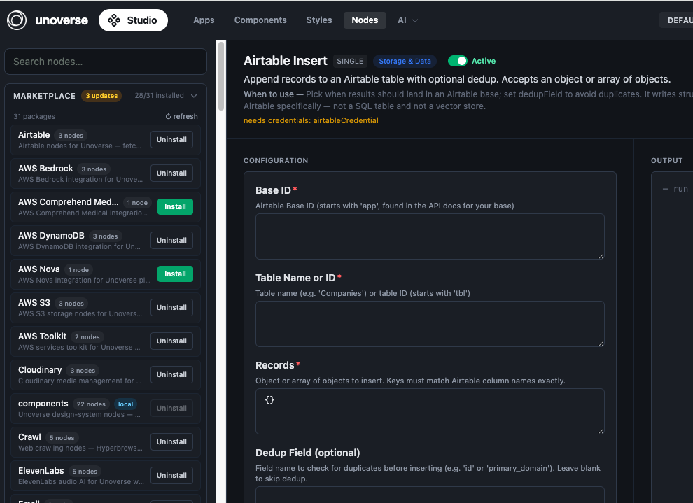

Your platform starts empty; the marketplace stocks it. Ready-made node packages, from OpenAI to Airtable and AWS, install with one click. Start here and download what your Agents will need.

## Before you begin

The platform is running (`unoverse dev`) and **Studio** is open at http://localhost:3002.

## Install a package

<Steps>
<Step title="Open the marketplace">

In **Studio**, open **Nodes**. The **Marketplace** rail on the left lists every available package, how many nodes each one contains, and what you have installed.

</Step>
<Step title="Install what you need">

Click **Install** on a package. Its nodes register with the platform and appear in the node library in **Canvas**, ready to drag into a workflow. **Uninstall** removes them the same way.

Install **OpenAI** now; the next challenge uses it to build your first Agent.

</Step>
<Step title="Add credentials where required">

Some nodes talk to external services and name the credential they need. Add it in **Canvas** under **Credentials**. The next challenge walks through this for your OpenAI key.

</Step>
<Step title="Stay current">

The marketplace badges packages with available updates. Click **Refresh** to check, then update a package in place.

</Step>
</Steps>

<Note>
Installed packages are part of your platform state, so they deploy themselves. Production reads the same state and installs the same packages automatically; there is nothing extra to ship.
</Note>

## Next steps

<Card title="Create your first Agent" icon="bot" href="./02-create-your-first-agent.md" horizontal>
Wire a trigger, a model, and a response together in Canvas, and talk to it.
</Card>

<Card title="Create your first node" icon="box" href="./03-create-your-first-node.md" horizontal>
Need something the marketplace doesn't have? Build it.
</Card>
