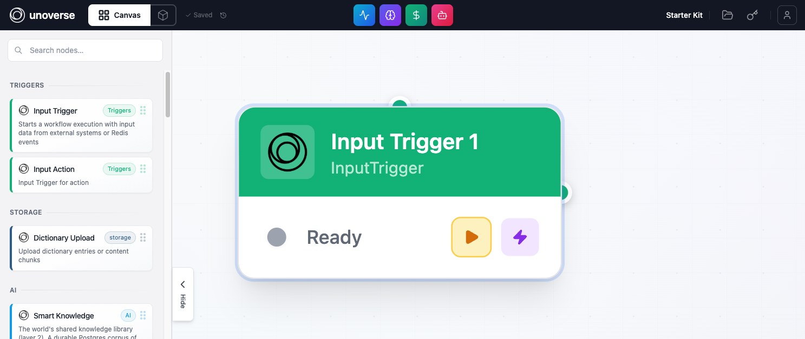
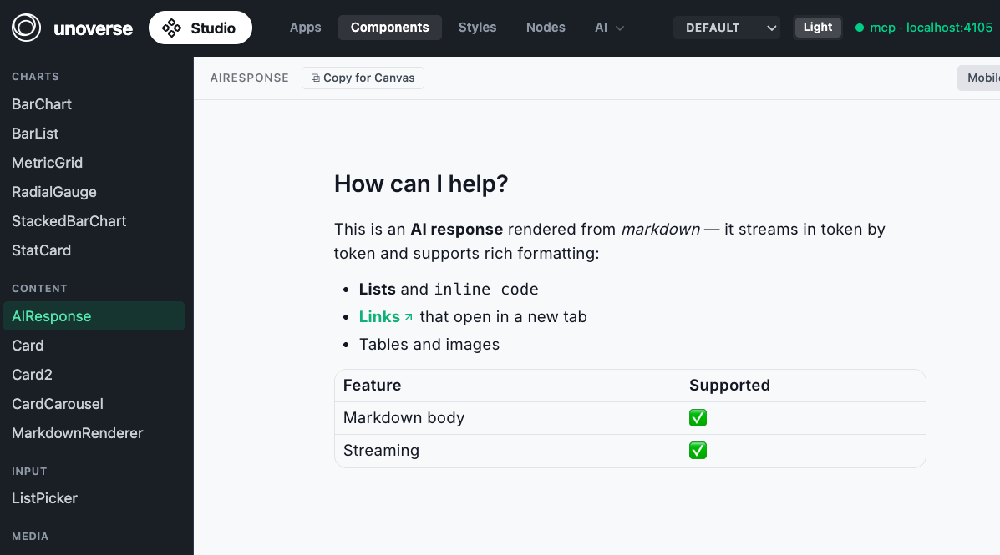
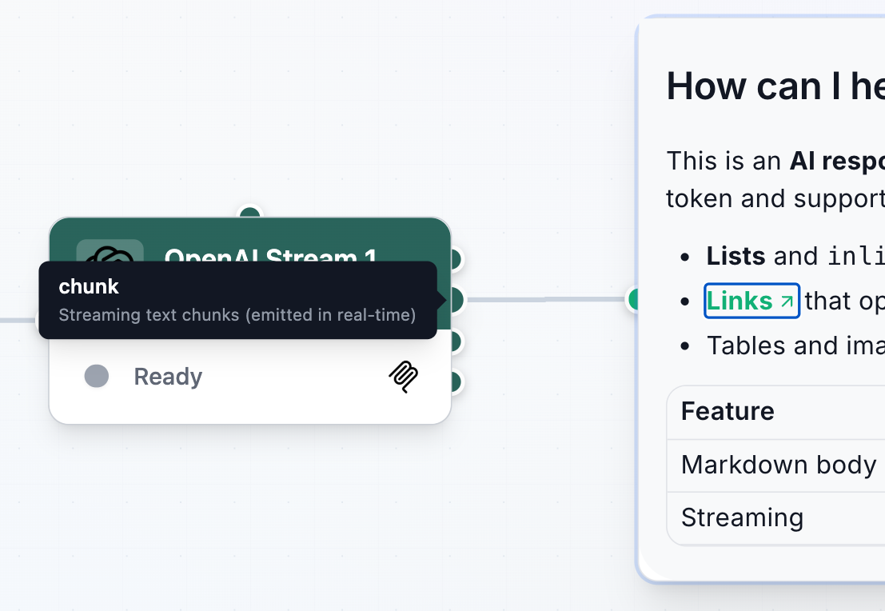
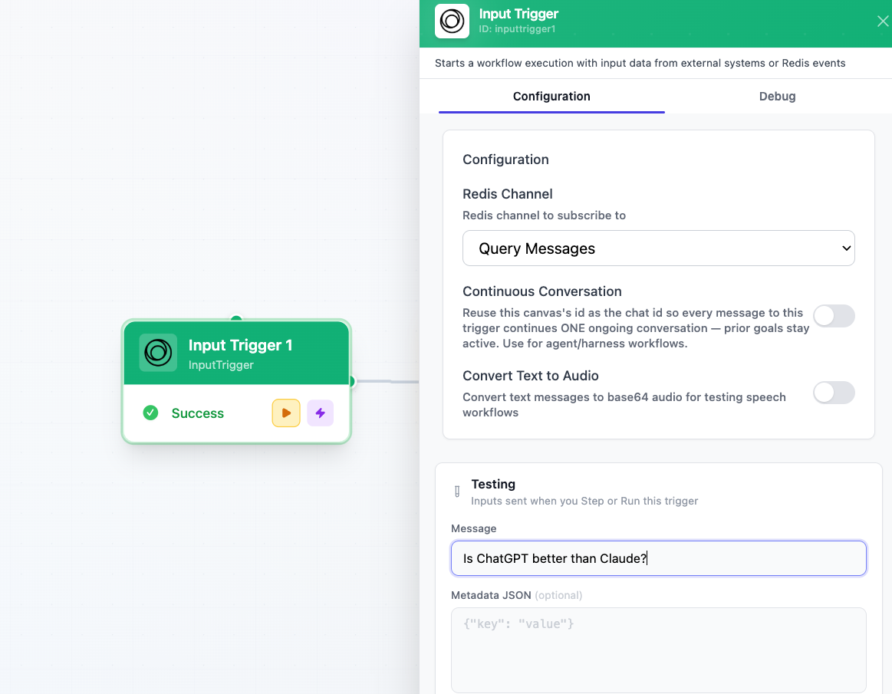
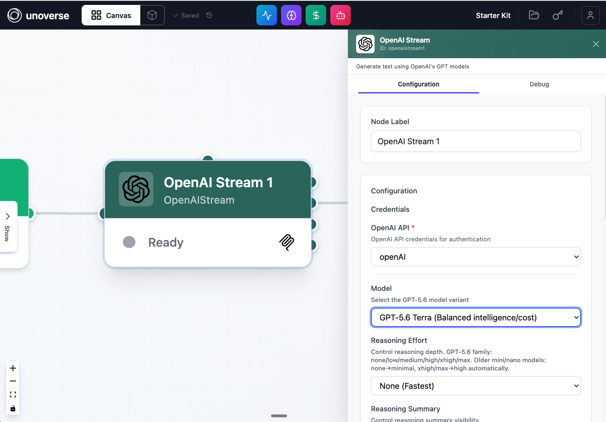
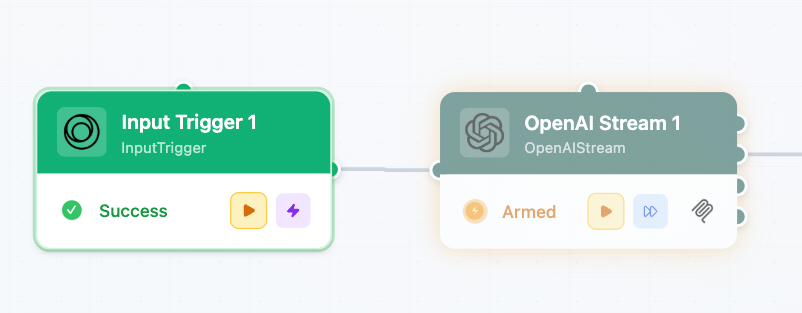
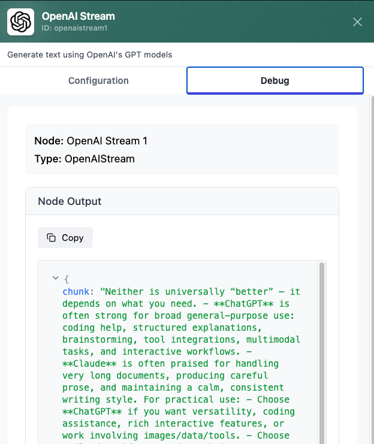

Build a chat Agent in **Canvas**: a trigger that receives the message, a model that thinks, and a response that streams back. Ten minutes, no code.

## Before you begin

The platform is running (`unoverse dev`) and **Canvas** is open at http://localhost:3001. You have an OpenAI API key, and the OpenAI package is installed from the [marketplace](./01-marketplace-nodes.md).

## Build it

<Steps>
<Step title="Add your OpenAI credential">

In **Canvas**, open **Credentials** and click **New credential**. Select the **OpenAI API** type, name it, paste your API key, and save. Nodes never read keys from config or env files; they request credentials at execution time, decrypted and injected by the platform.

</Step>
<Step title="Create a workflow">

Click **Create New Workflow** and name it. An empty **Canvas** opens.

</Step>
<Step title="Add three nodes">

The workflow needs three nodes:

1. Input Trigger receives the user's message.
2. OpenAI Stream sends it to the model and streams the reply.
3. AI Response displays the reply to the user.

Drag Input Trigger and OpenAI Stream from the node library onto the **Canvas**.

AI Response is a component, so it comes from **Studio**. Open **Components** in **Studio**, select **AIResponse**, and click **Copy for Canvas**. Then paste it into your **Canvas**.

Now connect them left to right: Input Trigger → OpenAI Stream → AI Response.

The dots on a node's edges are **connectors**. Each output connector carries one named signal. Hover over a connector to see its name and what it carries. The names matter: they are how downstream fields reference the data, as in `signal.openaistream1.chunk`.

OpenAI Stream has more than one output, so pick the right one: connect from its `chunk` connector. `chunk` streams, so the reply flows into AI Response as the model writes it.

<Note>
Every node instance gets an id: its type, lowercased, plus a number. Your three nodes are `inputtrigger1`, `openaistream1`, and `airesponse1`. Downstream nodes read upstream outputs through these ids: `signal.<nodeId>.<output>`.
</Note>

</Step>
<Step title="Set a test message">

Double-click Input Trigger to open its settings. Under **Testing**, enter a **Message**. This is the question that kicks off the flow when you run the trigger.

</Step>
<Step title="Configure the model">

Double-click OpenAI Stream to open its settings:

- **OpenAI API**: select the credential you created in step 1.
- **Model**: pick a GPT-5.6 variant.
- **System Prompt**: `You are a helpful assistant. Please answer the user's question.`
- **User Prompt**: `The user's question is {{signal.inputtrigger1.output.message}}`

The double braces are a Handlebars reference: at run time it resolves to the message the trigger received.

</Step>
<Step title="Configure the response">

Double-click AI Response:

- **Main response text**: `return signal.openaistream1.chunk`

This field takes JavaScript. `chunk` is the model's streaming output, so text appears live as the model writes. The complete reply is also available as `signal.openaistream1.text` once the node finishes.

<Note>
Config fields accept two syntaxes: Handlebars (`{{signal...}}`) for templating text, and JavaScript (`return signal...`) for computing a value. Use either; don't mix them in one field.
</Note>

</Step>
<Step title="Step through it">

Your workflow saves automatically as you build; there is no save button. Just run it: press the play button on Input Trigger to execute it with your test message. When a node completes, the next node in the chain becomes **armed** and flashes, meaning it is ready to run. Press its play button to step forward, inspecting each node's output as you go.

The moment a node runs, its output is ready to inspect. Double-click the node and open the **Debug** tab. It shows every signal the node produced and the exact value each one carried on this run.

Step through all three nodes and watch the reply stream into AI Response.

</Step>
</Steps>

## One more thing

Everything you just built by hand, Claude Code can build for you. The platform ships a builder MCP, registered by this repo's `.mcp.json`:

1. With the platform running, open this repo in Claude Code and approve the `unoverse-builder` server when it asks. Type `/mcp` at any time to confirm it shows as connected.
2. In **Canvas**, create a new empty workflow and copy the `wf-xxxxxx` id from the URL.
3. Ask:

> Bind workflow wf-xxxxxx, then build a chat agent: input trigger → OpenAI → response display. Test each stage with runTest before adding the next.

Claude binds to that one **Canvas**, builds stage by stage, and runs each stage while you watch the nodes appear live. It can't see or touch any other workflow.

## Next steps

<Card title="Create your first node" icon="box" href="./03-create-your-first-node.md" horizontal>
Extend the platform with your own logic.
</Card>

<Card title="Ingest content to Spatial" icon="globe" href="./04-ingest-content-to-spatial.md" horizontal>
Ground your Agent's answers in your own content.
</Card>
