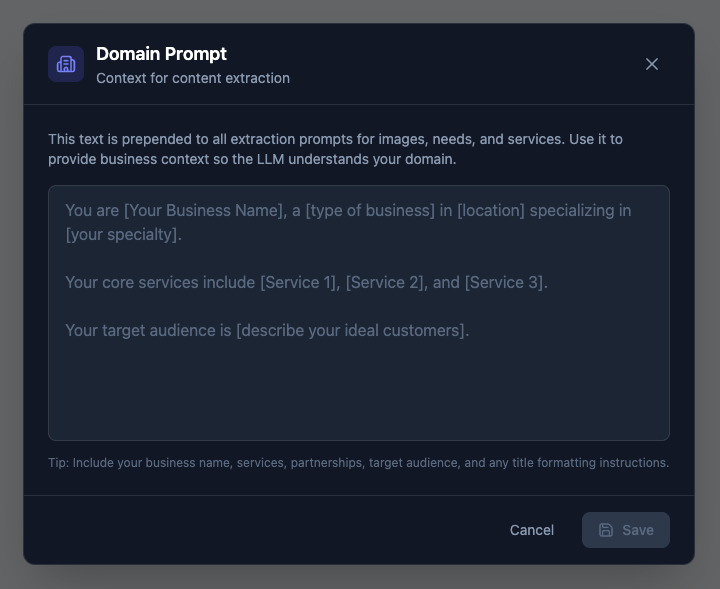
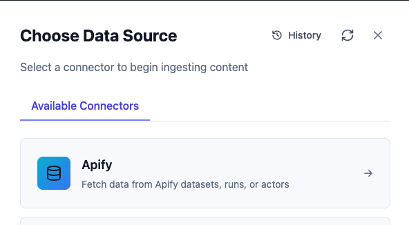
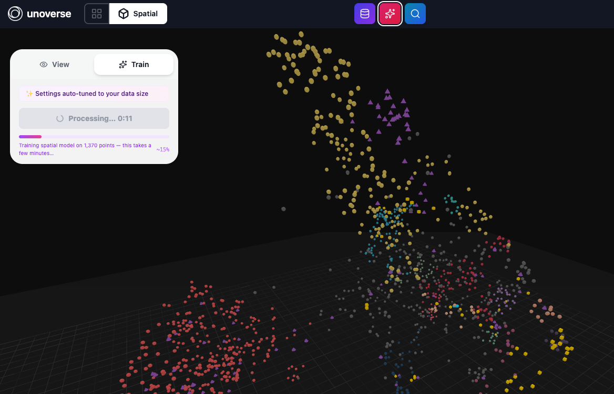
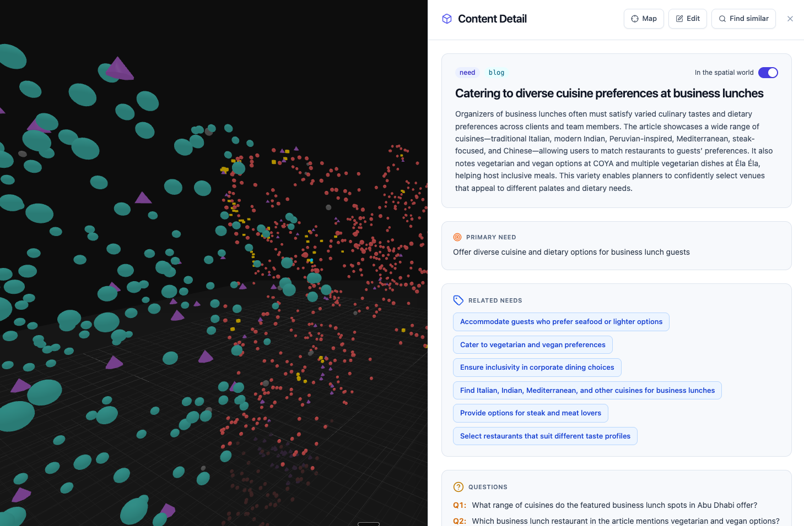
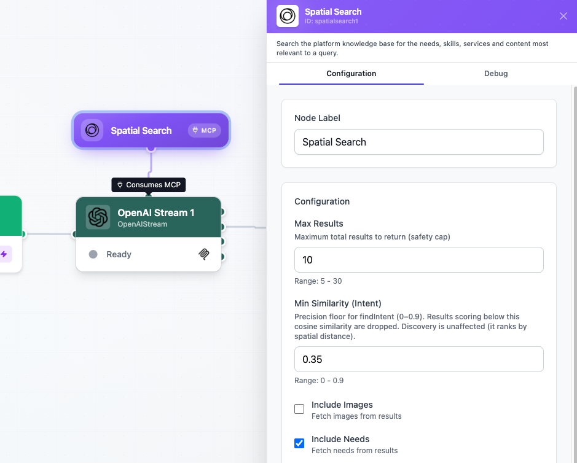

**Spatial** is where your Agents find what they need. In this challenge you ingest your own content, build the map, and give an Agent search over it.

**Spatial** has two parts:

| Part | Job |
| --- | --- |
| **Content Engine** | Ingests your content, reads each item, extracts what it means, and embeds it |
| **Spatial map** | Places every item in a 3D world where related things sit near each other |

You ingest through the Content Engine, then train the map. After that, both you and your Agents search the same space.

<Tip>
**Every Canvas has its own Spatial.** The content you ingest, the map you train, and the searches you run all belong to this workflow. A different canvas is a different world, with its own content and its own map.
</Tip>

## Before you begin

The platform is running (`unoverse dev`) and **Canvas** is open at http://localhost:3001. You have a content source to ingest; the connector table below lists what each source needs.

## Build your space

<Steps>
<Step title="Open Spatial">

In **Canvas**, click the **Spatial** button in the header. The 3D space opens; it's empty until you ingest. Its two neighbors matter in this challenge too: the database icon opens the **Content Library**, and the magnifier opens **Search**.

</Step>
<Step title="Ground the Content Engine">

Before you ingest anything, tell the Content Engine who you are. In the **Content Library**, click **Grounding** to open the Domain Prompt: your business name, what you do, your services, and your audience.

This text is prepended to every extraction prompt. Every item you ingest is read through it, so grounding first is what makes the Content Engine understand your content as yours, not as generic text.

</Step>
<Step title="Choose a data source">

Click **Import**, then **Choose Data Source**.

Each connector brings content in from a different place, and the list keeps growing:

| Connector | Brings in | Needs |
| --- | --- | --- |
| **Apify** | Datasets, runs, or actors from Apify | An Apify credential |
| **Apify Chunk** | The same, semantically chunked for search | An Apify credential |
| **Cloudinary** | Images from your Cloudinary library | A Cloudinary credential |
| **Google Sheets** | Rows from a public spreadsheet | A Google API credential |

Add the credential first in **Canvas** under **Credentials**, the same flow as [Create Your First Agent](./02-create-your-first-agent.md).

</Step>
<Step title="Import">

Select your connector, fill in its source fields, and run the import. Watch the item count climb as the Content Engine ingests. Each item is read, understood, and embedded on the way in.

</Step>
<Step title="Train Spatial">

Open the **Train** tab and click **Apply Clustering**. Settings are auto-tuned to your data size, so there is nothing to configure.

Training builds the map: every item gets a 3D position, and related items land near each other. The panel reports each stage as it runs; expect a few minutes.

<Tip>
The map is built with the UMAP algorithm. For further reading, see the [umap-learn documentation](https://umap-learn.readthedocs.io/) and [On Out-of-sample Embedding in UMAP (arXiv, 2026)](https://arxiv.org/html/2606.04451v1).
</Tip>

</Step>
<Step title="Explore">

- Points are colored by cluster, and clusters are themes in your content.
- Hover a point to see what it is.
- Double-click a point to open the content behind it: what the Content Engine extracted, the related items it connects to, and the questions it can answer.

</Step>
<Step title="Search it">

Open **Search** in the header. **Spatial** has exactly two searches, and the toggle switches between them. They answer different questions:

<CardGroup cols={2}>
<Card title="Intent" icon="crosshair">
*"Tell me about X."*

Specific and goal-based. The user names what they want, and Intent finds exactly that, ranked by meaning. Works as soon as content is ingested.
</Card>
<Card title="Discovery" icon="compass">
*"You may also be interested in..."*

Interest-based. Discovery surfaces similar and related items around a topic: options the user does not yet know exist. Cross-sell and upsell live here. Needs the trained map.
</Card>
</CardGroup>

One query shows the difference. Imagine a travel brand searching *family holidays in Mauritius*:

- **Intent** returns the Mauritius items, ranked by match.
- **Discovery** stands you in the family-getaway region of the map and lights up what lives there: the kids-club resorts, the waterpark day, the Seychelles alternative, the family excursion, the flight. The things the user didn't ask for but wants.

A ranked list can never give you that neighborhood. The map can, and it is why **Spatial** exists.

This pair is the heart of **Spatial**. Precision when the user names what they want; exploration when the user names a topic and the Agent should see what surrounds it. Agents in unoverse make great use of both: seeing the neighborhood, not just the match, is what lets an Agent make the optimal decision for the user.

Keep queries short: name the thing or the topic. Try both modes on the same query and compare what comes back. The stats under the results show how far each search reached and what it scanned.

</Step>
</Steps>

## How Agents use Spatial

Agents get access to the same two key search options, **Intent** and **Discovery**, and choose between them dynamically based on the goal and the task at hand.

Spatial Search is an MCP service node: it doesn't sit in the data flow. Connect it to any agent node with a service edge, and the Agent gains **Spatial** as a set of tools:

| Tool | What the Agent gets |
| --- | --- |
| `findIntent` | The precision search: exactly what the user named |
| `discoverRelated` | The neighborhood: related items and options around a topic |

**And it searches in batch.** One call can carry up to eight queries at once. Planning a family trip means the hotel, the dinner, the activities, and the flight; the Agent searches all of them in a single round trip, and every result comes back tagged with the query it answers. One call, all the material for an optimal answer.

To wire it up, drag Spatial Search onto your canvas and connect it to your agent node; the edge labels itself **Consumes MCP**. Double-click the node to open its settings.

The settings control what the Agent can see: which content types to include, how many results to return, and the similarity floor. Results reach the Agent as lean references, so context stays small; the Agent pulls an item's full content only when it matters.

## Try it end to end

Close the loop with your own site and your Challenge 2 Agent:

1. **Ingest your website.** Use the Apify connector with a site crawl of your pages, grounded by your Domain Prompt.
2. **Train Spatial**, then check a few points: does the extraction read like your business?
3. **Wire it into your Agent.** Open your [Create Your First Agent](./02-create-your-first-agent.md) workflow and connect Spatial Search to OpenAI Stream.
4. **Update the prompts.** Tell the model in the System Prompt to search your content and answer from what it finds, not from general knowledge.
5. **Test the results.** Ask a question your website answers, step through, and watch the reply ground itself in your own content. Then ask a broader question and watch Discovery bring in the neighborhood.

## Next steps

<Card title="Components and templates" icon="palette" href="./05-components-and-templates.md" horizontal>
Design the interfaces your Agents speak through.
</Card>

<Card title="Deployment" icon="server" href="./08-deployment.md" horizontal>
Take your platform to a production server.
</Card>
